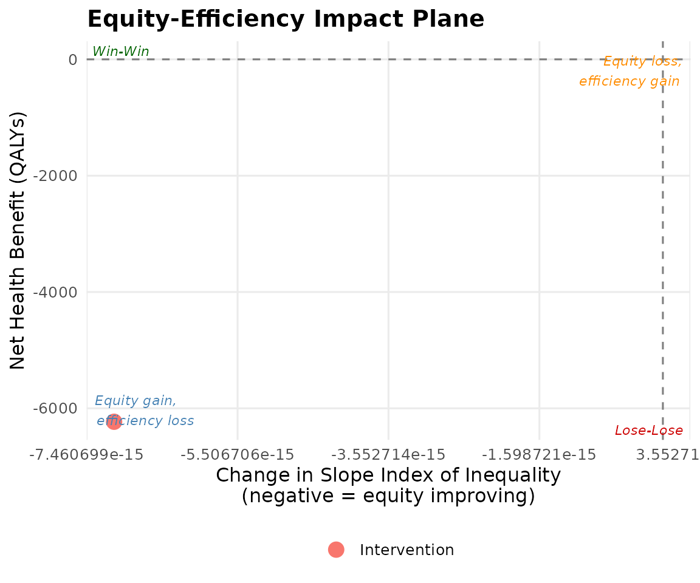

# Introduction to Distributional Cost-Effectiveness Analysis

## Why standard CEA ignores equity

Standard cost-effectiveness analysis (CEA) answers one question: does
this intervention generate more health per pound spent than the
alternatives? It aggregates health across all patients as if a QALY
gained by the most deprived person equals a QALY gained by the least
deprived.

This approach is silent on *who* benefits — and therefore on how
interventions affect health inequalities between socioeconomic groups.

## The DCEA framework

Distributional Cost-Effectiveness Analysis (DCEA), developed by Cookson,
Griffin, Norheim and Culyer (2020), extends standard CEA by:

1.  **Distributing** aggregate health gains across socioeconomic groups.
2.  **Measuring** the impact on health inequality (SII, Atkinson index,
    etc.).
3.  **Evaluating** the social welfare gain using inequality-aversion
    weights.
4.  **Visualising** the equity-efficiency trade-off on an impact plane.

## When to use aggregate vs full-form DCEA

| Method             | When to use                                            | Data required                            |
|--------------------|--------------------------------------------------------|------------------------------------------|
| **Aggregate DCEA** | Standard TA; disease-level HES data available          | ICER, incremental QALY/cost, disease ICD |
| **Full-form DCEA** | Subgroup trial data available; HST or exceptional case | Per-group QALY/cost estimates            |

NICE (2025) recommends aggregate DCEA as the default supplementary
analysis for technology appraisals where equity is relevant.

## Quick start

``` r
result <- run_aggregate_dcea(
  icer            = 28000,
  inc_qaly        = 0.45,
  inc_cost        = 12600,
  population_size = 12000,
  wtp             = 20000,
  opportunity_cost_threshold = 13000
)

summary(result)
#> == Aggregate DCEA Result ==
#>   ICER:             £28,000 / QALY
#>   Incremental QALY: 0.4500
#>   Incremental cost: £12,600
#>   Population size:  12,000
#>   Net Health Benefit: -6230.77 QALYs
#>   SII change:         -0.0000
#>   Decision:           Trade-off: equity gain, efficiency loss
#> 
#> -- Per-group results --
#> # A tibble: 5 × 4
#>   group_label         baseline_hale post_hale    nhb
#>   <chr>                       <dbl>     <dbl>  <dbl>
#> 1 Q1 (most deprived)           52.1      52.0 -1246.
#> 2 Q2                           56.3      56.2 -1246.
#> 3 Q3                           59.8      59.7 -1246.
#> 4 Q4                           63.2      63.1 -1246.
#> 5 Q5 (least deprived)          66.8      66.7 -1246.
#> 
#> -- Inequality impact --
#> # A tibble: 4 × 5
#>   index           pre     post    change pct_change
#>   <chr>         <dbl>    <dbl>     <dbl>      <dbl>
#> 1 sii        18.2     18.2     -7.11e-15  -3.91e-14
#> 2 rii         0.304    0.305    5.31e- 4   1.74e- 1
#> 3 gini        0.0487   0.0488   8.49e- 5   1.74e- 1
#> 4 atkinson_1  0.00374  0.00376  1.32e- 5   3.52e- 1
```

``` r
plot_equity_impact_plane(result)
```



## Key references

- Cookson R, Griffin S, Norheim OF, Culyer AJ (2020). *Distributional
  Cost-Effectiveness Analysis*. Oxford University Press.
  <https://doi.org/10.1093/oso/9780198838197.001.0001>

- NICE (2025). *Technology Evaluation Methods: Health Inequalities*
  (PMG36).

- Love-Koh J et al. (2019). Value in Health 22(5): 518-526.
