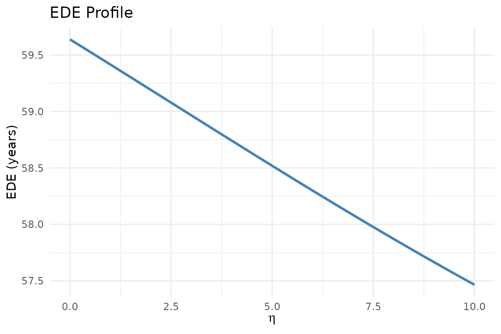

# Social Welfare Functions in DCEA

## Atkinson Social Welfare Function

The Atkinson SWF evaluates population health by penalising inequality
according to the parameter eta (η). Higher η = stronger aversion to
inequality.

The Equally Distributed Equivalent (EDE) health is the key output: the
level of health that, if equally distributed, would give the same social
welfare as the actual distribution.

## Choosing eta: evidence from the UK

Robson et al. (2017) elicited public preferences for health inequality
aversion in England using a questionnaire. Their central estimate was η
≈ 1, with a range of 0.1 to 4.8 across the sample.

NICE (2025) does not mandate a specific η but expects sensitivity
analysis across a range including 0, 1, and higher values.

## EDE calculation

``` r
health  <- c(52.1, 56.3, 59.8, 63.2, 66.8)
weights <- rep(0.2, 5)

# eta = 0: no inequality aversion (arithmetic mean)
calc_ede(health, weights, eta = 0)
#> [1] 59.64

# eta = 1: moderate aversion (geometric mean)
calc_ede(health, weights, eta = 1)
#> [1] 59.41665

# eta = 5: strong aversion
calc_ede(health, weights, eta = 5)
#> [1] 58.51938
```

## EDE profile

``` r
profile <- calc_ede_profile(health, weights, eta_range = seq(0, 10, 0.1))
library(ggplot2)
ggplot(profile, aes(eta, ede)) +
  geom_line(colour = "steelblue", linewidth = 1) +
  labs(x = expression(eta), y = "EDE (years)",
       title = "EDE Profile") +
  theme_minimal()
```



## Equity weights

``` r
ew <- calc_equity_weights(health, weights, eta = 1)
ew  # Q1 (most deprived) gets highest weight
#> [1] 1.1361198 1.0513649 0.9898301 0.9365798 0.8861054
```

## Social welfare decomposition

``` r
post_health <- health + c(0.5, 0.6, 0.5, 0.4, 0.3)
calc_social_welfare(health, post_health, weights, eta = 1)
#> $ede_baseline
#> [1] 59.41665
#> 
#> $ede_post
#> [1] 59.88513
#> 
#> $delta_ede
#> [1] 0.4684784
#> 
#> $efficiency_component
#> [1] 0.46
#> 
#> $equity_component
#> [1] 0.008478412
```

## References

Robson M et al. (2017). Health Economics 26(10): 1328-1334.
<https://doi.org/10.1002/hec.3386>
