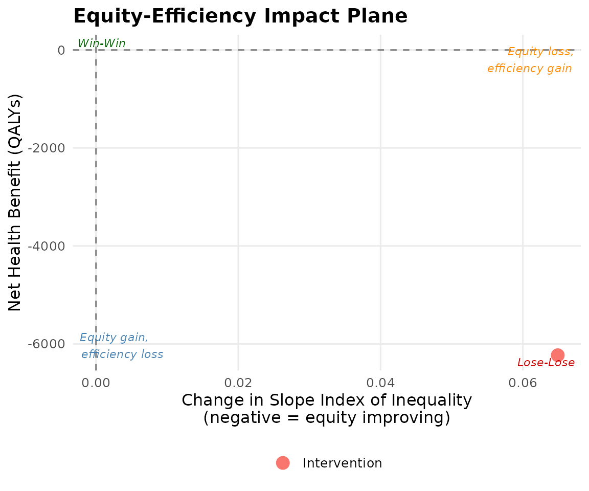

# NICE Submission Workflow

## NICE 2025 requirements

NICE (2025) Methods Support Document (PMG36) on health inequalities
requires manufacturers to submit DCEA as supplementary evidence when:

- The intervention targets a condition with documented SES gradients.
- The ICER is above £20,000/QALY and equity may affect the decision.
- The committee requests equity evidence.

## Step-by-step NICE workflow

### 1. Determine method

Use **aggregate DCEA** unless subgroup-specific evidence is available.

``` r
# Check whether disease has SES gradient
# Use disease_icd to auto-lookup HES utilisation
result <- run_aggregate_dcea(
  icer            = 28000,
  inc_qaly        = 0.45,
  inc_cost        = 12600,
  population_size = 12000,
  disease_icd     = "C34",
  wtp             = 20000,
  opportunity_cost_threshold = 13000
)
```

### 2. Sensitivity analysis

NICE expects sensitivity over key parameters, especially η.

``` r
sa <- run_dcea_sensitivity(result, params_to_vary = c("eta", "wtp", "occ_threshold"))
sa$eta_profile
#> # A tibble: 11 × 5
#>      eta equity_weight_q1 equity_weight_q5 equity_weighted_nhb delta_ede
#>    <int>            <dbl>            <dbl>               <dbl>     <dbl>
#>  1     0             1               1                  -1246.    -0.104
#>  2     1             1.14            0.886              -1265.    -0.106
#>  3     2             1.28            0.779              -1284.    -0.108
#>  4     3             1.43            0.680              -1303.    -0.110
#>  5     4             1.59            0.589              -1322.    -0.112
#>  6     5             1.75            0.506              -1340.    -0.114
#>  7     6             1.92            0.432              -1358.    -0.116
#>  8     7             2.09            0.366              -1374.    -0.118
#>  9     8             2.25            0.308              -1390.    -0.119
#> 10     9             2.42            0.258              -1405.    -0.121
#> 11    10             2.58            0.215              -1419.    -0.122
```

### 3. Generate submission table

``` r
tbl <- generate_nice_table(result, format = "tibble")
knitr::kable(tbl, caption = "DCEA Summary Table (NICE format)")
```

| Equity subgroup     | Baseline HALE (years) | Post-intervention HALE (years) | Change in HALE (years) | Net Health Benefit (QALYs) | Population share |
|:--------------------|----------------------:|-------------------------------:|-----------------------:|---------------------------:|:-----------------|
| Q1 (most deprived)  |                  52.1 |                          51.97 |                -0.1298 |                   -1557.69 | 0                |
| Q2                  |                  56.3 |                          56.18 |                -0.1168 |                   -1401.92 | 0                |
| Q3                  |                  59.8 |                          59.70 |                -0.1038 |                   -1246.15 | 0                |
| Q4                  |                  63.2 |                          63.11 |                -0.0909 |                   -1090.38 | 0                |
| Q5 (least deprived) |                  66.8 |                          66.72 |                -0.0779 |                    -934.62 | 0                |
| Total / Summary     |                    NA |                             NA |                     NA |                   -6230.77 | 1.000            |

DCEA Summary Table (NICE format)

### 4. Export to Excel

``` r
export_dcea_excel(result, "dcea_submission.xlsx")
```

### 5. Present impact plane

``` r
plot_equity_impact_plane(result)
```



## NICE compliance checklist

Aggregate DCEA conducted using England IMD quintile baseline

Opportunity cost threshold set to £13,000/QALY

Sensitivity analysis over η range 0-10

Equity-efficiency impact plane included

SII, RII, and Atkinson index reported pre and post

NICE submission table generated

Results presented as supplementary to base-case CEA

## References

NICE (2025). *Technology Evaluation Methods: Health Inequalities*
(PMG36). National Institute for Health and Care Excellence.
