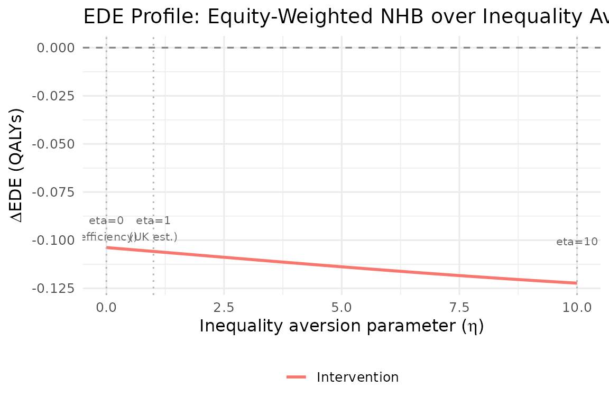

# Aggregate DCEA Tutorial

## Overview

This tutorial walks through aggregate DCEA step-by-step for a
hypothetical NSCLC (lung cancer) treatment, following the Love-Koh et
al. (2019) method.

## Step 1: Define CEA inputs

``` r
icer            <- 28000   # £/QALY
inc_qaly        <- 0.45    # incremental QALYs per patient
inc_cost        <- 12600   # incremental cost per patient (£)
population_size <- 12000   # eligible patients in England
wtp             <- 20000   # NICE standard WTP (£/QALY)
occ_threshold   <- 13000   # opportunity cost threshold (£/QALY)
```

## Step 2: Load baseline health distribution

``` r
baseline <- get_baseline_health("england", "imd_quintile")
baseline
#> # A tibble: 5 × 14
#>   imd_quintile group quintile_label      group_label     mean_hale mean_hale_all
#>          <int> <int> <chr>               <chr>               <dbl>         <dbl>
#> 1            1     1 Q1 (most deprived)  Q1 (most depri…      52.1          52.1
#> 2            2     2 Q2                  Q2                   56.3          56.3
#> 3            3     3 Q3                  Q3                   59.8          59.8
#> 4            4     4 Q4                  Q4                   63.2          63.2
#> 5            5     5 Q5 (least deprived) Q5 (least depr…      66.8          66.8
#> # ℹ 8 more variables: mean_hale_male <dbl>, mean_hale_female <dbl>,
#> #   se_hale <dbl>, se_hale_all <dbl>, pop_share <dbl>, cumulative_rank <dbl>,
#> #   year <int>, source <chr>
```

## Step 3: Run aggregate DCEA

``` r
result <- run_aggregate_dcea(
  icer                       = icer,
  inc_qaly                   = inc_qaly,
  inc_cost                   = inc_cost,
  population_size            = population_size,
  disease_icd                = "C34",
  wtp                        = wtp,
  opportunity_cost_threshold = occ_threshold
)
```

## Step 4: Interpret outputs

``` r
summary(result)
#> == Aggregate DCEA Result ==
#>   ICER:             £28,000 / QALY
#>   Incremental QALY: 0.4500
#>   Incremental cost: £12,600
#>   Population size:  12,000
#>   Net Health Benefit: -6230.77 QALYs
#>   SII change:         0.0649
#>   Decision:           Lose-Lose (efficiency loss + equity loss)
#> 
#> -- Per-group results --
#> # A tibble: 5 × 4
#>   group_label         baseline_hale post_hale    nhb
#>   <chr>                       <dbl>     <dbl>  <dbl>
#> 1 Q1 (most deprived)           52.1      52.0 -1558.
#> 2 Q2                           56.3      56.2 -1402.
#> 3 Q3                           59.8      59.7 -1246.
#> 4 Q4                           63.2      63.1 -1090.
#> 5 Q5 (least deprived)          66.8      66.7  -935.
#> 
#> -- Inequality impact --
#> # A tibble: 4 × 5
#>   index           pre     post    change pct_change
#>   <chr>         <dbl>    <dbl>     <dbl>      <dbl>
#> 1 sii        18.2     18.2     0.0649         0.358
#> 2 rii         0.304    0.306   0.00162        0.533
#> 3 gini        0.0487   0.0490  0.000259       0.533
#> 4 atkinson_1  0.00374  0.00379 0.0000402      1.07
```

### Per-group results

``` r
result$by_group
#> # A tibble: 5 × 10
#>   group group_label   baseline_hale post_hale pop_share patient_share n_patients
#>   <int> <chr>                 <dbl>     <dbl>     <dbl>         <dbl>      <dbl>
#> 1     1 Q1 (most dep…          52.1      52.0       0.2         0.25        3000
#> 2     2 Q2                     56.3      56.2       0.2         0.225       2700
#> 3     3 Q3                     59.8      59.7       0.2         0.2         2400
#> 4     4 Q4                     63.2      63.1       0.2         0.175       2100
#> 5     5 Q5 (least de…          66.8      66.7       0.2         0.15        1800
#> # ℹ 3 more variables: health_gain_qaly <dbl>, opp_cost_qaly <dbl>, nhb <dbl>
```

### Inequality impact

``` r
result$inequality_impact
#> # A tibble: 4 × 5
#>   index           pre     post    change pct_change
#>   <chr>         <dbl>    <dbl>     <dbl>      <dbl>
#> 1 sii        18.2     18.2     0.0649         0.358
#> 2 rii         0.304    0.306   0.00162        0.533
#> 3 gini        0.0487   0.0490  0.000259       0.533
#> 4 atkinson_1  0.00374  0.00379 0.0000402      1.07
```

## Step 5: Visualise

``` r
plot_equity_impact_plane(result)
```


``` r
plot_ede_profile(result, eta_range = seq(0, 10, 0.2))
```



## Step 6: Generate NICE submission table

``` r
generate_nice_table(result, format = "tibble")
#> # A tibble: 6 × 6
#>   `Equity subgroup`   `Baseline HALE (years)` `Post-intervention HALE (years)`
#>   <chr>                                 <dbl>                            <dbl>
#> 1 Q1 (most deprived)                     52.1                             52.0
#> 2 Q2                                     56.3                             56.2
#> 3 Q3                                     59.8                             59.7
#> 4 Q4                                     63.2                             63.1
#> 5 Q5 (least deprived)                    66.8                             66.7
#> 6 Total / Summary                        NA                               NA  
#> # ℹ 3 more variables: `Change in HALE (years)` <dbl>,
#> #   `Net Health Benefit (QALYs)` <dbl>, `Population share` <chr>
```

## References

Love-Koh J et al. (2019). Value in Health 22(5): 518-526.
<https://doi.org/10.1016/j.jval.2018.10.007>
