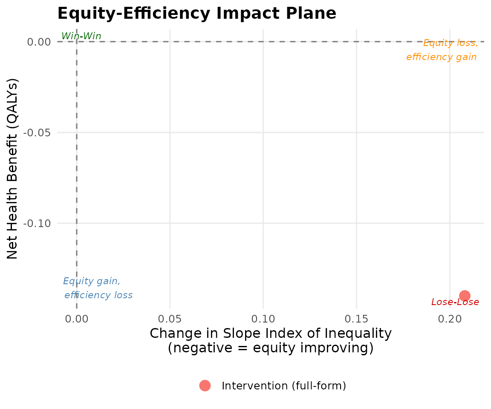
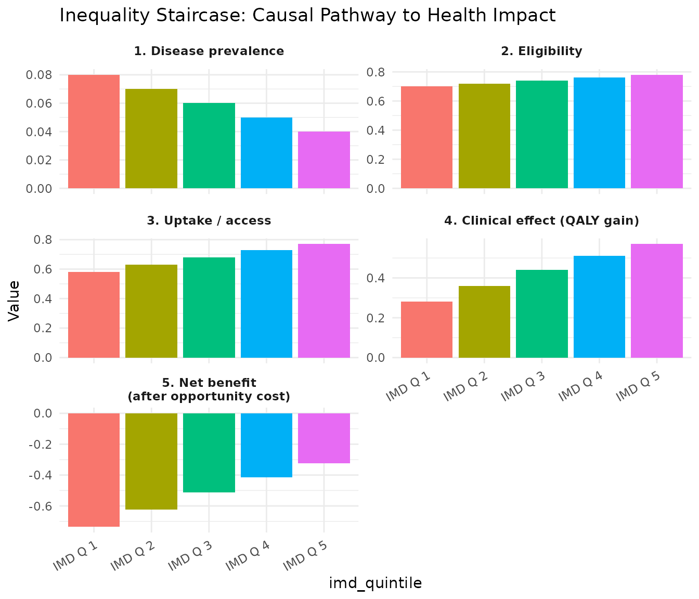

# Full-Form DCEA Tutorial

## When to use full-form DCEA

Full-form DCEA is appropriate when subgroup-specific clinical evidence
is available — for example, differential uptake by deprivation,
differential survival benefit by SES, or trial subgroup data stratified
by socioeconomic characteristics.

## The inequality staircase

The five steps of the staircase define how patient-level benefit
distributes across IMD groups:

1.  **Disease prevalence** — who gets the disease?
2.  **Eligibility** — who meets criteria for the treatment?
3.  **Uptake / access** — who actually receives it?
4.  **Clinical effect** — what QALY gain does each group achieve?
5.  **Opportunity cost** — what health is displaced in each group?

## Worked example: NSCLC with subgroup evidence

``` r
baseline <- get_baseline_health("england", "imd_quintile")
```

### Subgroup-specific CEA inputs

``` r
subgroup_data <- tibble::tibble(
  group       = 1:5,
  group_label = paste("IMD Q", 1:5),
  inc_qaly    = c(0.28, 0.36, 0.44, 0.51, 0.57),
  inc_cost    = c(13200, 12800, 12400, 12000, 11600),
  pop_share   = c(0.28, 0.24, 0.20, 0.16, 0.12)
)
subgroup_data
#> # A tibble: 5 × 5
#>   group group_label inc_qaly inc_cost pop_share
#>   <int> <chr>          <dbl>    <dbl>     <dbl>
#> 1     1 IMD Q 1         0.28    13200      0.28
#> 2     2 IMD Q 2         0.36    12800      0.24
#> 3     3 IMD Q 3         0.44    12400      0.2 
#> 4     4 IMD Q 4         0.51    12000      0.16
#> 5     5 IMD Q 5         0.57    11600      0.12
```

### Differential uptake

``` r
uptake <- c(0.58, 0.63, 0.68, 0.73, 0.77)
```

### Run full-form DCEA

``` r
result_full <- run_full_dcea(
  subgroup_cea_results       = subgroup_data,
  baseline_health            = baseline,
  wtp                        = 20000,
  opportunity_cost_threshold = 13000,
  uptake_by_group            = uptake
)
summary(result_full)
#> == Full-Form DCEA Result ==
#>   Net Health Benefit (equity-weighted): -0.1400 QALYs
#>   SII change: 0.2080
#>   Decision:   Lose-Lose (efficiency loss + equity loss)
#> 
#> -- Per-group results --
#> # A tibble: 5 × 5
#>   group_label inc_qaly_adj      nhb baseline_hale post_hale
#>   <chr>              <dbl>    <dbl>         <dbl>     <dbl>
#> 1 IMD Q 1            0.162 -0.220            52.1      51.7
#> 2 IMD Q 2            0.227 -0.176            56.3      55.9
#> 3 IMD Q 3            0.299 -0.122            59.8      59.5
#> 4 IMD Q 4            0.372 -0.0657           63.2      62.9
#> 5 IMD Q 5            0.439 -0.00770          66.8      66.6
```

### Visualise

``` r
plot_equity_impact_plane(result_full)
```



### Inequality staircase

``` r
sc_data <- build_staircase_data(
  group           = 1:5,
  group_labels    = paste("IMD Q", 1:5),
  prevalence      = c(0.08, 0.07, 0.06, 0.05, 0.04),
  eligibility     = c(0.70, 0.72, 0.74, 0.76, 0.78),
  uptake          = uptake,
  clinical_effect = subgroup_data$inc_qaly,
  opportunity_cost = subgroup_data$inc_cost / 13000
)
```

``` r
plot_inequality_staircase(sc_data)
```


