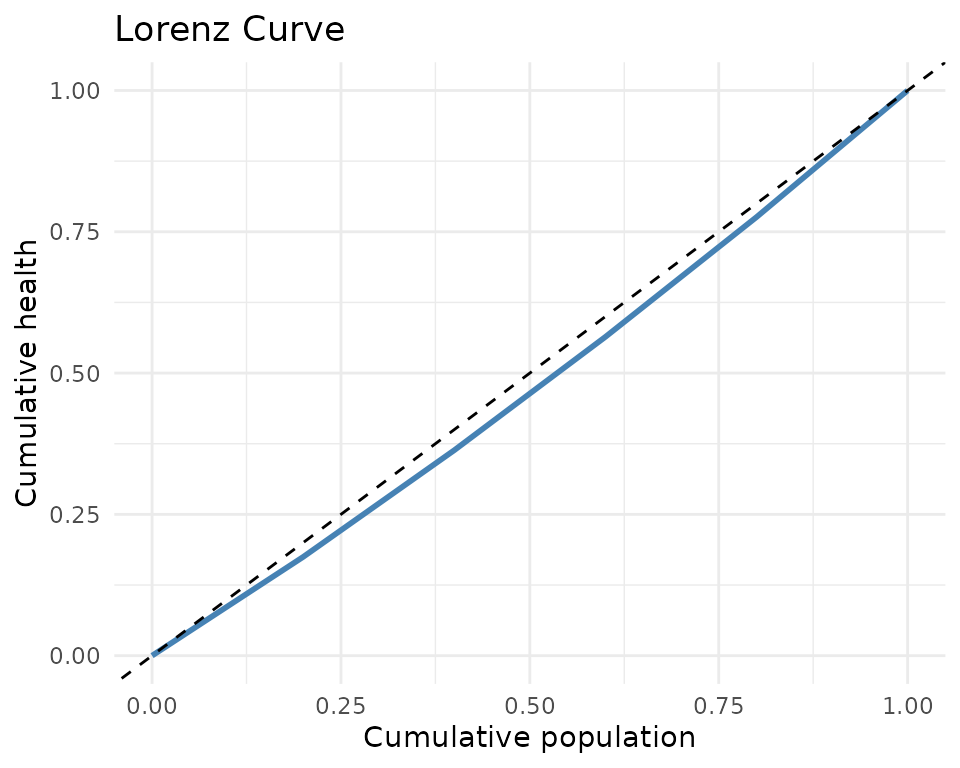

# Inequality Measurement in DCEA

## Overview

`dceasimR` provides five inequality measures commonly used in DCEA: SII,
RII, concentration index, Atkinson index, and Gini coefficient.

``` r
df <- tibble::tibble(
  group      = 1:5,
  mean_hale  = c(52.1, 56.3, 59.8, 63.2, 66.8),
  pop_share  = rep(0.2, 5)
)
```

## Slope Index of Inequality (SII)

The SII estimates the absolute health difference from the most to the
least deprived using a weighted regression on ridit scores.

``` r
calc_sii(df, "mean_hale", "group", "pop_share")
#> $sii
#> [1] 18.15
#> 
#> $rii
#> [1] 0.304326
#> 
#> $se_sii
#> [1] 0.4112988
#> 
#> $p_value
#> [1] 2.561597e-05
#> 
#> $model
#> 
#> Call:
#> stats::lm(formula = h ~ ridit, weights = w)
#> 
#> Coefficients:
#> (Intercept)        ridit  
#>       50.56        18.15
```

A positive SII means better health in more advantaged groups.

## Relative Index of Inequality (RII)

The RII expresses the SII relative to mean health, facilitating
comparisons across populations and time.

``` r
calc_rii(df, "mean_hale", "group", "pop_share")
#> $sii
#> [1] 18.15
#> 
#> $rii
#> [1] 0.304326
#> 
#> $se_sii
#> [1] 0.4112988
#> 
#> $p_value
#> [1] 2.561597e-05
#> 
#> $model
#> 
#> Call:
#> stats::lm(formula = h ~ ridit, weights = w)
#> 
#> Coefficients:
#> (Intercept)        ridit  
#>       50.56        18.15  
#> 
#> 
#> $se_rii
#> [1] 0.006896357
```

## Concentration Index

``` r
calc_concentration_index(df, "mean_hale", "group", "pop_share",
                          type = "standard")
#> $ci
#> [1] 0.04869215
#> 
#> $se
#> [1] NA
#> 
#> $type
#> [1] "standard"
```

## Atkinson Index

``` r
calc_atkinson_index(df$mean_hale, df$pop_share, epsilon = 1)
#> [1] 0.003744955
```

## Gini Coefficient

``` r
calc_gini(df$mean_hale, df$pop_share)
#> [1] 0.04869215
```

## All indices at once

``` r
calc_all_inequality_indices(df, "mean_hale", "group", "pop_share",
                             epsilon_values = c(0.5, 1, 2))
#> # A tibble: 7 × 3
#>   index                   value description                   
#>   <chr>                   <dbl> <chr>                         
#> 1 sii                  18.2     Slope Index of Inequality     
#> 2 rii                   0.304   Relative Index of Inequality  
#> 3 concentration_index   0.0487  Concentration Index (standard)
#> 4 gini                  0.0487  Gini coefficient              
#> 5 atkinson_epsilon_0.5  0.00187 Atkinson index (epsilon = 0.5)
#> 6 atkinson_epsilon_1    0.00374 Atkinson index (epsilon = 1)  
#> 7 atkinson_epsilon_2    0.00751 Atkinson index (epsilon = 2)
```

## Lorenz curves

``` r
ld <- compute_lorenz_data(df$mean_hale, df$pop_share, "England 2019")
```

``` r
library(ggplot2)
ggplot(ld, aes(cum_pop, cum_health)) +
  geom_line(colour = "steelblue", linewidth = 1) +
  geom_abline(linetype = "dashed") +
  labs(x = "Cumulative population", y = "Cumulative health",
       title = "Lorenz Curve") +
  theme_minimal()
```


