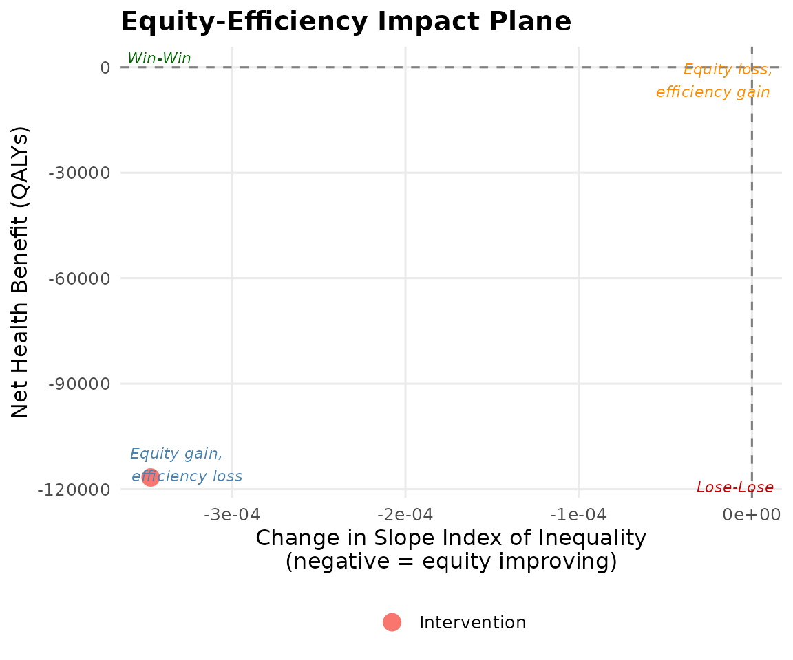

# International Applications of DCEA

## Canada (CADTH workflow)

CADTH uses income quintile stratification. Use `country = "canada"` to
access the preloaded Statistics Canada HALE data.

``` r
canada_baseline <- get_baseline_health("canada", "income_quintile")
canada_baseline
#> # A tibble: 5 × 12
#>   income_quintile group quintile_label      group_label mean_hale mean_hale_male
#>             <int> <int> <chr>               <chr>           <dbl>          <dbl>
#> 1               1     1 Q1 (lowest income)  Q1 (lowest…      62.4           60.8
#> 2               2     2 Q2                  Q2               65.1           63.6
#> 3               3     3 Q3                  Q3               67.3           65.9
#> 4               4     4 Q4                  Q4               69.4           68.1
#> 5               5     5 Q5 (highest income) Q5 (highes…      71.8           70.5
#> # ℹ 6 more variables: mean_hale_female <dbl>, se_hale <dbl>, pop_share <dbl>,
#> #   cumulative_rank <dbl>, year <int>, source <chr>

result_ca <- run_aggregate_dcea(
  icer                       = 50000,   # CAD/QALY
  inc_qaly                   = 0.40,
  inc_cost                   = 20000,
  population_size            = 8000,
  baseline_health            = canada_baseline,
  wtp                        = 50000,
  opportunity_cost_threshold = 30000
)
summary(result_ca)
#> == Aggregate DCEA Result ==
#>   ICER:             £50,000 / QALY
#>   Incremental QALY: 0.4000
#>   Incremental cost: £20,000
#>   Population size:  8,000
#>   Net Health Benefit: -2133.33 QALYs
#>   SII change:         -0.0000
#>   Decision:           Trade-off: equity gain, efficiency loss
#> 
#> -- Per-group results --
#> # A tibble: 5 × 4
#>   group_label         baseline_hale post_hale   nhb
#>   <chr>                       <dbl>     <dbl> <dbl>
#> 1 Q1 (lowest income)           62.4      62.3 -427.
#> 2 Q2                           65.1      65.0 -427.
#> 3 Q3                           67.3      67.2 -427.
#> 4 Q4                           69.4      69.3 -427.
#> 5 Q5 (highest income)          71.8      71.7 -427.
#> 
#> -- Inequality impact --
#> # A tibble: 4 × 5
#>   index           pre     post    change pct_change
#>   <chr>         <dbl>    <dbl>     <dbl>      <dbl>
#> 1 sii        11.6     11.6     -1.24e-14  -1.08e-13
#> 2 rii         0.172    0.172    1.37e- 4   7.94e- 2
#> 3 gini        0.0275   0.0275   2.18e- 5   7.94e- 2
#> 4 atkinson_1  0.00119  0.00119  1.89e- 6   1.59e- 1
```

## WHO regional analysis

For global health or multi-country analyses, use WHO regional HALE data.

``` r
who_baseline <- get_baseline_health("who_regions")
who_baseline
#> # A tibble: 6 × 10
#>   who_region region_label          group group_label mean_hale se_hale pop_share
#>   <chr>      <chr>                 <int> <chr>           <dbl>   <dbl>     <dbl>
#> 1 AFR        African Region            1 African Re…      53.8     1.2     0.163
#> 2 AMR        Region of the Americ…     2 Region of …      66.1     0.8     0.13 
#> 3 SEAR       South-East Asia Regi…     3 South-East…      60.3     0.9     0.271
#> 4 EUR        European Region           4 European R…      68.9     0.6     0.147
#> 5 EMR        Eastern Mediterranea…     5 Eastern Me…      59.4     1       0.088
#> 6 WPR        Western Pacific Regi…     6 Western Pa…      68.3     0.7     0.201
#> # ℹ 3 more variables: cumulative_rank <dbl>, year <int>, source <chr>
```

``` r
result_who <- run_aggregate_dcea(
  icer                       = 1000,
  inc_qaly                   = 0.35,
  inc_cost                   = 350,
  population_size            = 500000,
  baseline_health            = who_baseline,
  wtp                        = 1000,
  opportunity_cost_threshold = 600
)
plot_equity_impact_plane(result_who)
```



## Custom country workflow

For countries without preloaded data, supply your own baseline:

``` r
custom_baseline <- tibble::tibble(
  group           = 1:4,
  group_label     = c("Poorest quartile", "Q2", "Q3", "Richest quartile"),
  mean_hale       = c(55.0, 60.0, 65.0, 70.0),
  se_hale         = c(0.8, 0.7, 0.6, 0.5),
  pop_share       = rep(0.25, 4),
  cumulative_rank = c(0.125, 0.375, 0.625, 0.875),
  year            = 2022L,
  source          = "Custom country data"
)

result_custom <- run_aggregate_dcea(
  icer                       = 5000,
  inc_qaly                   = 0.3,
  inc_cost                   = 1500,
  population_size            = 100000,
  baseline_health            = custom_baseline,
  wtp                        = 5000,
  opportunity_cost_threshold = 3000
)
#> Warning in summary.lm(model): essentially perfect fit: summary may be
#> unreliable
#> Warning in summary.lm(model): essentially perfect fit: summary may be
#> unreliable
#> Warning in summary.lm(model): essentially perfect fit: summary may be
#> unreliable
#> Warning in summary.lm(model): essentially perfect fit: summary may be
#> unreliable
#> Warning in summary.lm(model): essentially perfect fit: summary may be
#> unreliable
#> Warning in summary.lm(model): essentially perfect fit: summary may be
#> unreliable
summary(result_custom)
#> == Aggregate DCEA Result ==
#>   ICER:             £5,000 / QALY
#>   Incremental QALY: 0.3000
#>   Incremental cost: £1,500
#>   Population size:  100,000
#>   Net Health Benefit: -20000.00 QALYs
#>   SII change:         0.0000
#>   Decision:           Lose-Lose (efficiency loss + equity loss)
#> 
#> -- Per-group results --
#> # A tibble: 4 × 4
#>   group_label      baseline_hale post_hale   nhb
#>   <chr>                    <dbl>     <dbl> <dbl>
#> 1 Poorest quartile            55      55.0 -5000
#> 2 Q2                          60      60.0 -5000
#> 3 Q3                          65      65.0 -5000
#> 4 Richest quartile            70      70.0 -5000
#> 
#> -- Inequality impact --
#> # A tibble: 4 × 5
#>   index           pre     post   change pct_change
#>   <chr>         <dbl>    <dbl>    <dbl>      <dbl>
#> 1 sii        20       20.0     1.42e-14   7.11e-14
#> 2 rii         0.32     0.320   2.56e- 4   8.01e- 2
#> 3 gini        0.0500   0.0500  4.00e- 5   8.01e- 2
#> 4 atkinson_1  0.00402  0.00402 6.47e- 6   1.61e- 1
```
